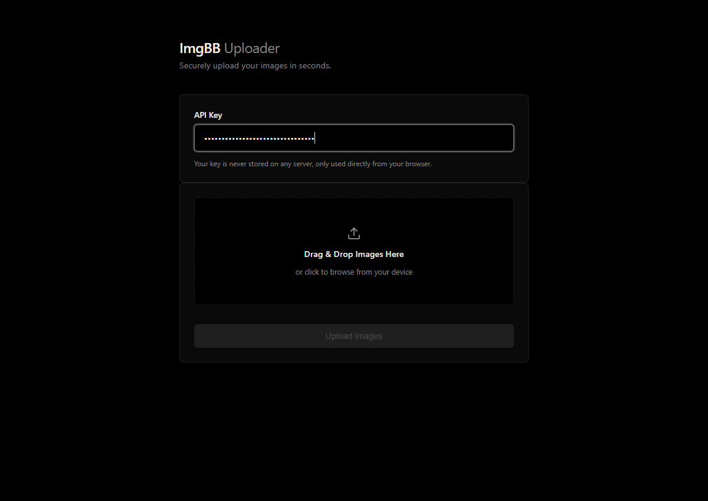

# ImgBB Uploader Premium

A sleek, ultra-professional web-based image uploader built to interact seamlessly with the [ImgBB API](https://api.imgbb.com/). Designed with a minimalist, high-contrast monochrome aesthetic, this tool allows you to securely upload images directly from your browser without any backend processing overhead.



## Features
- **Direct Browser Uploads**: Uploads images straight to ImgBB securely from the client side. Your API key never touches a third-party server.
- **Drag & Drop Interface**: Seamlessly drop images onto the page or click to browse.
- **Real-Time Previews**: Generates local thumbnail previews of your selected images instantly.
- **Links-Only Mode**: A custom toggle switch to collapse the results grid into a compact list of raw URLs with 1-click copy buttons, making bulk uploading a breeze.
- **Premium UI**: Hand-crafted, modern, minimalist UI that feels like a native developer tool.

## Setup & Usage

1. **Start a local server**:
   Serve the `public` directory using any local web server. For example, using Node.js:
   ```bash
   npx serve public
   ```
2. **Open the app**:
   Navigate to `http://localhost:3000` in your web browser.
3. **Configure your API Key**:
   Paste your ImgBB API v1 Key into the input field. (It securely saves to your browser's local storage so you don't have to enter it again).
4. **Upload**:
   Drag, drop, and upload!

## Technologies Used
- HTML5
- CSS3 (CSS Variables, Grid, Flexbox)
- Vanilla JavaScript (ES6+, Fetch API, FormData)

---
*Built to eliminate the friction of image hosting.*
